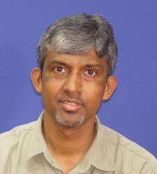

***

## Convenor
* [K. Gopinath (कांचि गोपीनाथ)](http://drona.csa.iisc.ernet.in/~gopi/){:target="_blank"} 
 

K. Gopinath is a professor at Indian Institute of Science in the Computer Science and Automation Department.  
His education has been at IIT-Madras (B.Tech'77), University of Wisconsin, Madison (MS'80) and Stanford University (PhD'88). 
He has also worked at AMD (Sunnyvale) ('80-'82), and as a PostDoc ('88-'89) at Stanford, and also briefly at Sun Microsystems Labs ('90).  
His research interests are primarily in the computer systems area (Operating Systems, Storage Systems, Systems Security and Systems Verification).

***

## Current Students

### Ph.D.

<table>
	<tr >
 		<td>
	 		&#8281;
	 	</td>
	 	<td>
	 		
	 	</td>
	 	<td>
		 	<a href="http://clweb.csa.iisc.ernet.in/priyankasingla/" target="_blank"><b>Priyanka Singla </b></a> 
		 	 
		 	Research Area:
	 	</td>
	 </tr>
 	<tr >
 		<td>
	 		&#8281;
	 	</td>
	 	<td>
	 		
	 	</td>
	 	<td>
		 	<a href="javascript:void(0)" target="_blank"><b>Subhendu Bhadra</b></a> 
		 	 
		 	Research Area:
	 	</td>
	 </tr>
</table>

### MSc Engg

 <table>
 	<tr>
 		<td>
	 		&#8281;
	 	</td>
	 	<td>
	 		
	 	</td>
	 	<td>
		 	<a href="javascript:void(0)" target="_blank"><b>Naman Patel</b></a> 
		 	 
		 	Research Area: 
	 	</td>
	 </tr>
 	<tr>
 		<td>
	 		&#8281;
	 	</td>
	 	<td>
	 		
	 	</td>
	 	<td>
		 	<a href="http://arpith.xyz" target="_blank"><b>Arpith K</b></a> 
		 	 
		 	Research Area: File Systems
	 	</td>
	 </tr>
</table>

### M.E.

<table>
	<tr>
 		<td>
	 		&#8281;
	 	</td>
	 	<td>
	 		
	 	</td>
	 	<td>
		 	<a href="javascript:void(0)" target="_blank"><b>Ashwin TV </b></a> 
		 	 
		 	Research Area: 
	 	</td>
	 </tr>
 	<tr>
 		<td>
	 		&#8281;
	 	</td>
	 	<td>
	 		
	 	</td>
	 	<td>
		 	<a href="javascript:void(0)" target="_blank"><b>Jawad T</b></a> 
		 	 
		 	Research Area: Operating System Security
	 	</td>
	 </tr>
	 <tr>
 		<td>
	 		&#8281;
	 	</td>
	 	<td>
	 		
	 	</td>
	 	<td>
		 	<a href="javascript:void(0)" target="_blank"><b>Muhammed Fazal</b></a> 
		 	 
		 	Research Area: Operating System Security
	 	</td>
	 </tr>
</table>

### Project Staff

### Research Assistant

***
