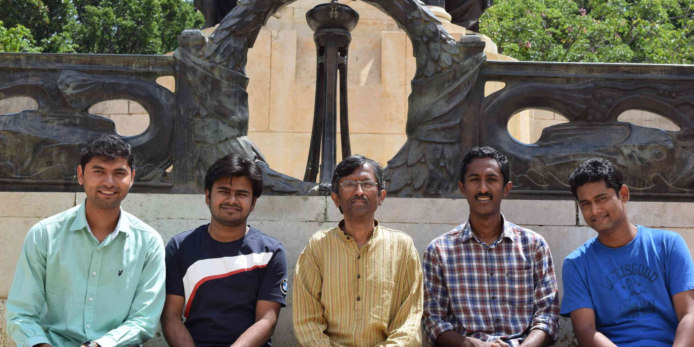
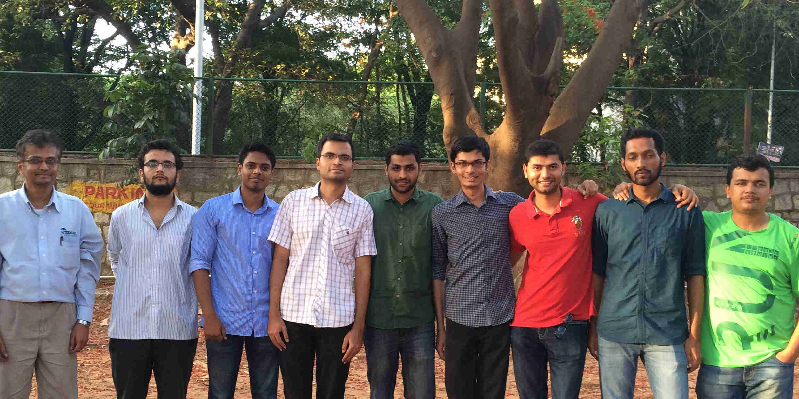
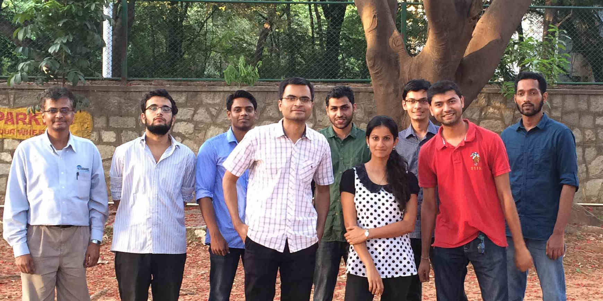

	Welcome to Computer Architecture and Systems Lab in the Department of Computer Science and Automation, Indian Institute of Science, Bangalore

<!-- Slideshow 2 -->

	<ul class="rslides" id="slider2">
		<li></li>
		<li></li>
		<li></li>
	</ul>

## Areas of Research
The following are some of the areas in which we work on:

* Operating systems
* Filesystems
* Storage Systems
* Clustered and Distributed Storage
* Cloud Storage
* Solid-State Storage
* Mobile Computing
* Storage Caching
* Protocols and Verification

***

## Latest Publications
* [Prudent Memory Reclamation in Procrastination based Synchronization]()
<b>Aravinda Prasad, K Gopinath</b> ASPLOS 2016
* [More &#8608;](publications)

***

## Facilities

* 40 Node Cluster each with 3 TB HDD, 8-core & 8 GB RAM
* CASL Wi-Fi
* [More &#8608;](facilities)

***

Have questions or suggestions? Feel free to [contact us](contact).

Thanks for stopping by!

